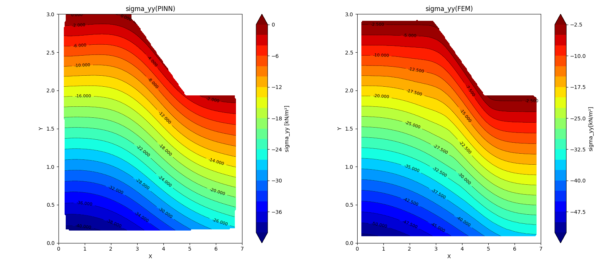

# PINNs-SlopeStability-MohrCoulomb
This repository implements **Physics-Informed Neural Networks (PINNs)** for slope stability analysis based on the **Mohr-Coulomb failure criterion**. The aim is to evaluate slope stability under various conditions, providing insights into critical parameters such as safety factors, displacement, and stress distribution.

## Features
- **Mohr-Coulomb Model**: Implements the Mohr-Coulomb failure criterion for assessing slope stability.
- **Physics-Informed Training**: Utilizes PINNs to incorporate physical laws directly into the training process, improving accuracy and efficiency.
- **Loss Function**: A custom loss function that combines boundary conditions and physics-based constraints.
- **Visualization Tools**: Tools for visualizing displacement, stress, and other relevant parameters through heatmaps and contour plots.

## Model Details

The PiNN is trained using:
- **Physics equations**: 2D linear elasto plastic using **Mohr-Coulomb Model**
- **Material parameters**:
  - Young's Modulus soil layer (E): 50000 kN/m²   (for example) to compare with FEM from Plaxis2d
  - Poisson's Ratio (ν): 0.3
  - Cohesion = 3 kPa (for example) to compare with FEM from Plaxis2d
  - Friction angle = 13° (for example) to compare with FEM from Plaxis2d
  - Unit Weight (γ): 18 kN/m³ (for example) to compare with FEM from Plaxis2d
- **Boundary Conditions**: Fixed displacements on the bottom, left, and right sides.
- 

## Result





-**Safety factor from PiNNs** = 1.54
-**Safety factor from FEM** = 1.876 

- ## Requirements
- Python 3.x
- PyTorch
- NumPy
- Matplotlib
- Pandas
## Installation

Install the necessary tools using:

```bash
pip install torch matplotlib numpy
pip install pandas
pip install pytorch
